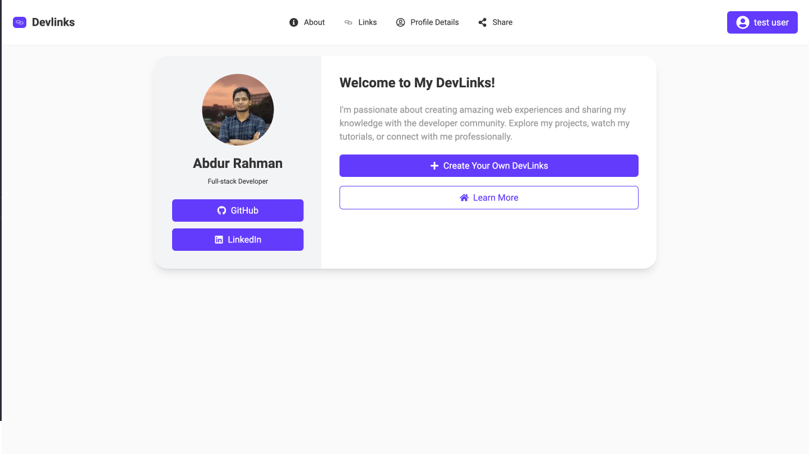
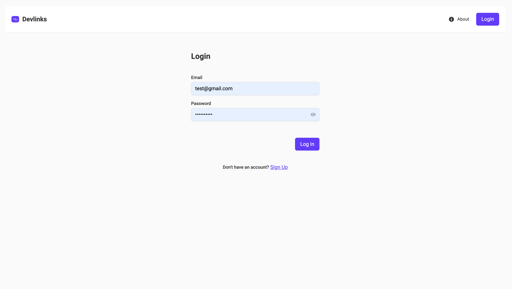
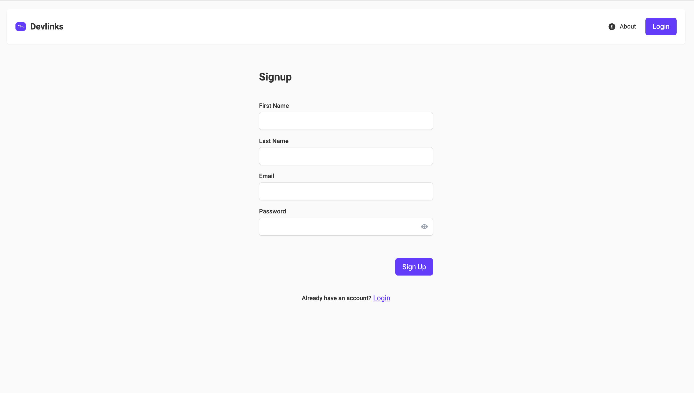

# kahf_devlinks

## Project Description

Kahf DevLinks is a project that allows developers to create and manage their personal link-sharing pages.

## Screenshots and Features

Here are some key features of the Kahf DevLinks project along with brief descriptions:

### Landing Page



The main landing page provides:

- An overview of the Kahf DevLinks project
- Key features and benefits of using the platform
- Call-to-action buttons for signing up or logging in

### Authentication




The authentication system includes:

- A login page for existing users
- A signup page for new users to create an account
- Secure user authentication and authorization

### Profile Management


In the profile management section, users can:

- View their current profile information
- Edit personal details such as name and email
- Upload or update their profile image

### Link Management


The link management page allows users to:

- Add new links to their profile
- Edit existing links (URL, Platform)
- View all current links associated with their profile
- Rearrange links using drag-and-drop functionality

### Share Page


The share page enables users to:

- Generate a shareable link for their profile
- Copy the link to clipboard for easy sharing
- (Optional) Share directly to social media platforms

### Preview Mode


The preview mode allows users to:

- See how their link-sharing page will appear to visitors
- View their profile information as it will be displayed publicly

## Technologies and Dependencies

This project uses the following main technologies and npm packages:

- Next.js: React framework for building the frontend
- React: JavaScript library for building user interfaces
- TypeScript: Typed superset of JavaScript
- Tailwind CSS: Utility-first CSS framework
- React DnD: Drag and drop for React
- Axios: Promise-based HTTP client for making API requests
- NextAuth: Authentication for Next.js
- [Add any other major dependencies you're using]

## Setup Instructions

### Prerequisites

- Node.js (version 14.0.0 or higher)
- npm (version 6.0.0 or higher)

### Installation

1. Clone the repository:

   ```
   git clone https://github.com/AREmondev/kahf_devlinks.git
   cd kahf_devlinks
   ```

2. Install dependencies:

   You have several options for installing dependencies:

   Install dependencies for both frontend and backend:

   ```
   npm run install-all
   ```

   This command will install dependencies for the main project, frontend, and backend.

   # Or alternatively:

   Install dependencies for frontend only:

   ```
   npm run install-frontend
   ```

   Install dependencies for backend only:

   ```
   npm run install-backend
   ```

   Install dependencies separately:

   For frontend:

   ```
   cd dev-links_front
   npm install
   ```

   For backend:

   ```
   cd dev-links_back
   npm install
   ```

3. Set up environment variables:

   For Frontend:

   - Navigate to the frontend directory:
     ```
     cd dev-links_front
     ```
   - Copy the `.env.example` file to `.env`:
     ```
     cp .env.example .env
     ```
   - Open the `.env` file and fill in the necessary values

   For Backend:

   - Navigate to the backend directory:
     ```
     cd dev-links_back
     ```
   - Copy the `.env.example` file to `.env`:
     ```
     cp .env.example .env
     ```
   - Open the `.env` file and fill in the necessary values

## Environment Variables

### Frontend (.env)

```plaintext
NEXT_PUBLIC_API_URL=http://localhost:8000/api/v1/
NEXT_PUBLIC_MEDIA_URL=http://localhost:8000
NEXTAUTH_SECRET=your_nextauth_secret
NEXTAUTH_URL=http://localhost:3000/api/auth
```

### Backend (.env)

```plaintext
NODE_ENV=development
PORT=8000
MONGODB_USERNAME=your_mongodb_username
MONGODB_PASSWORD=your_mongodb_password
MONGODB_CLUSTER=your_mongodb_cluster
MONGODB_DATABASE=your_mongodb_database
JWT_SECRET=your_jwt_secret
JWT_REFRESH_SECRET=your_jwt_refresh_secret
```

Note: Ensure that you never commit your actual .env files to version control. The .env.example files should contain placeholder values and be committed instead.

## Running the Project

You can run the frontend and backend together or separately using the following npm scripts:

### Running Both Frontend and Backend

To start both the frontend and backend concurrently:

```
npm start
```

### Running Frontend Only

To start only the frontend development server:

```
npm run start-frontend
```

### Running Backend Only

To start only the backend server:

```
npm run start-backend
```

### Additional Scripts

- `npm run install-frontend`: Install dependencies for the frontend project only
- `npm run install-backend`: Install dependencies for the backend project only

## Development Workflow

The frontend will be available at `http://localhost:3000`
The backend API will be available at `http://localhost:8000`

Remember to keep both the frontend and backend running while developing your application.

## Additional Information

Will be added soon

## Contributing

Will be added soon

## License

Will be added soon
